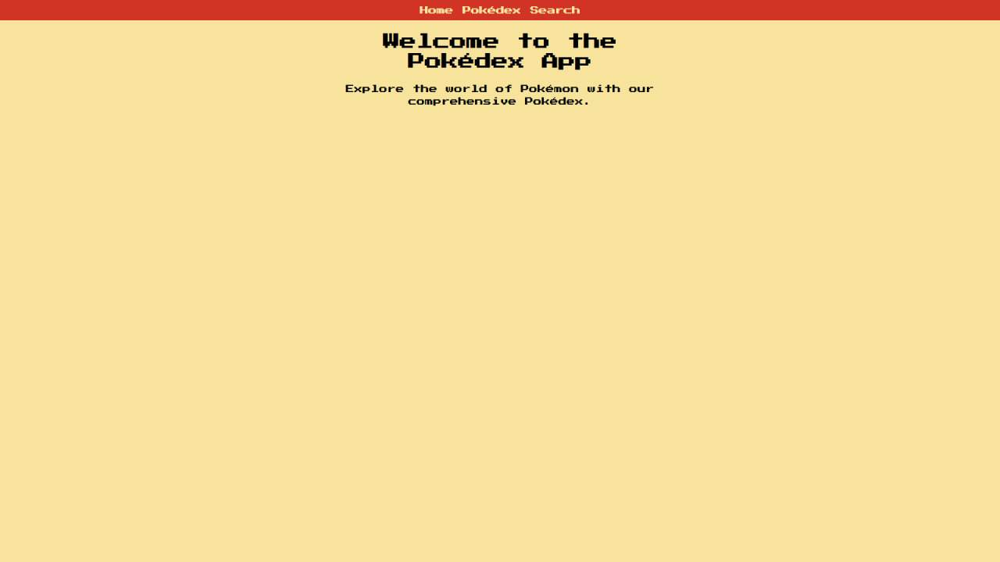
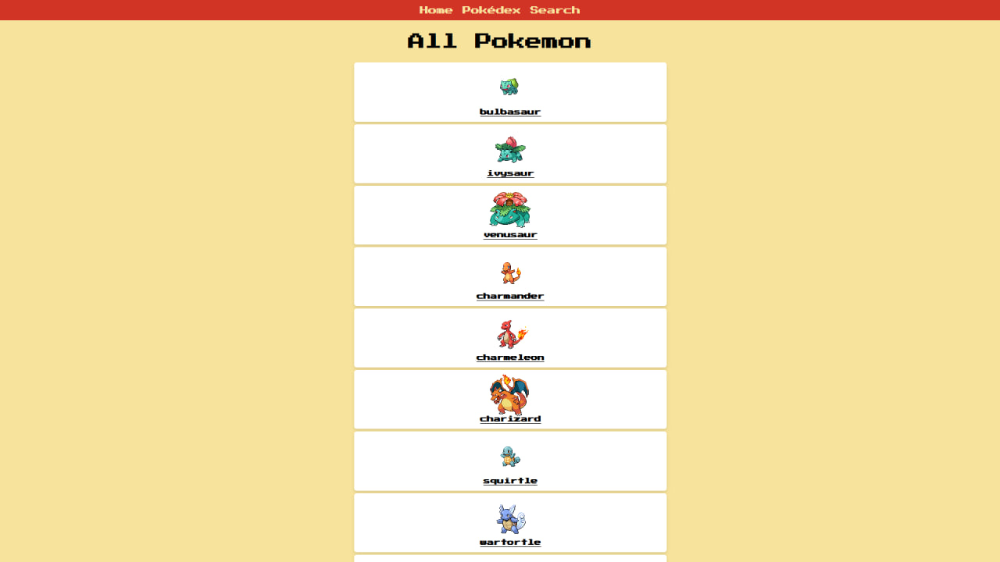
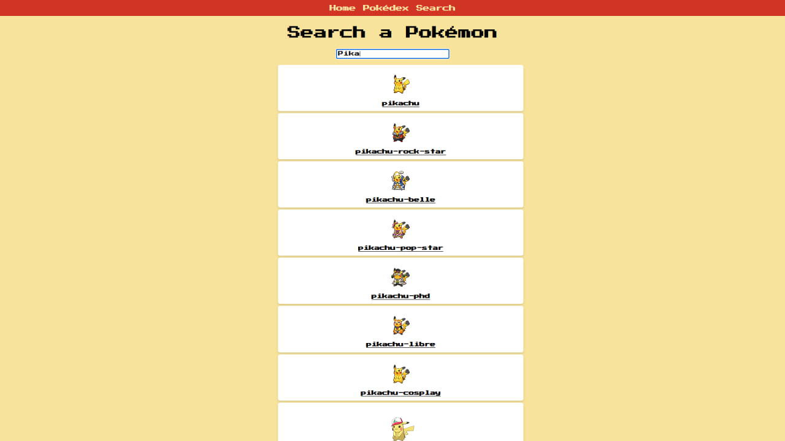

# 📱 Pokedex React App

A simple single-page React application that displays a list of Pokémon with a name-based search filter.

## 🚀 Tech Stack

- React
- CSS (modular styles)
- JSX
- Array methods (`map`, `filter`)
- Component-based architecture

## 📸 Screenshot





## 📁 Project Structure

Pokedex project/
├── App.jsx
├── App.css
├── Home.jsx
├── Pokedex.jsx
├── Pokemon.jsx
├── PokemonCard.jsx
├── Search.jsx
├── index.html
├── index.jsx
├── /screenshots/
│ └── home-page.png
└── README.md

## 🧠 What I Learned

- Building reusable components in React
- Passing and handling props
- Rendering dynamic lists using `map()`
- Filtering arrays in JSX
- Styling with custom fonts and scoped CSS

## 📦 Installation & Run

```bash
npm install
npm start

🔗 My GitHub
github.com/BomBletTM